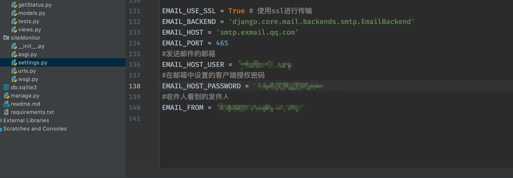
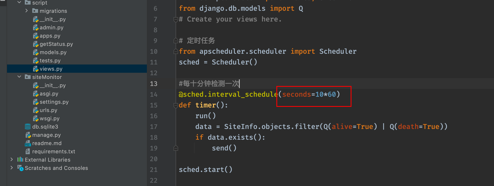
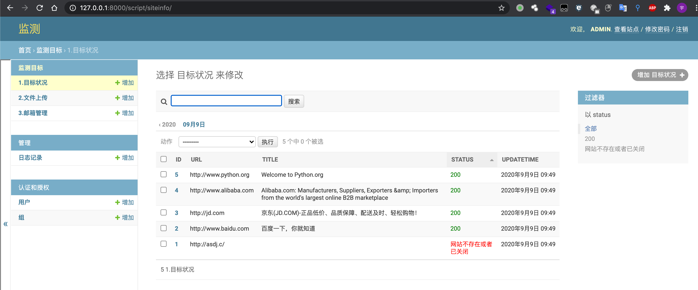
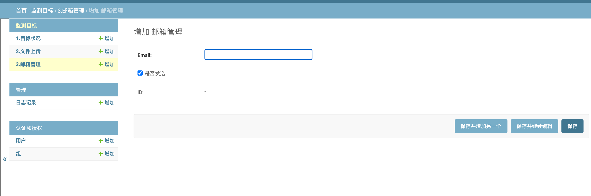

## 站点监测平台搭建使用

本平台使用Python3 和Django 框架

`pip install -r requirements.txt`

在 siteMonitor文件夹下的setting.py修改邮件服务配置，当站点访问状态变化时，邮件通知

在views.py 中修改后台循环检测时间

使用  `python3 manage.py runserver`   启动服务

后台用户名/密码：admin admin

访问 http://127.0.0.1:8000/admin/script/siteinfo/

## 效果图

目标状况增加按钮可以增加单个目标

文件上传增加，是读取文本，适用于多个目标

邮箱管理处增加邮箱接收人（可以选中多个邮件）

